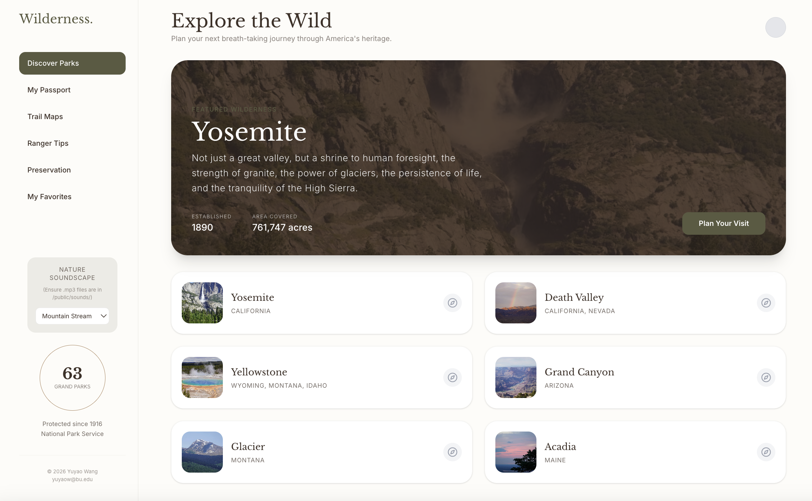
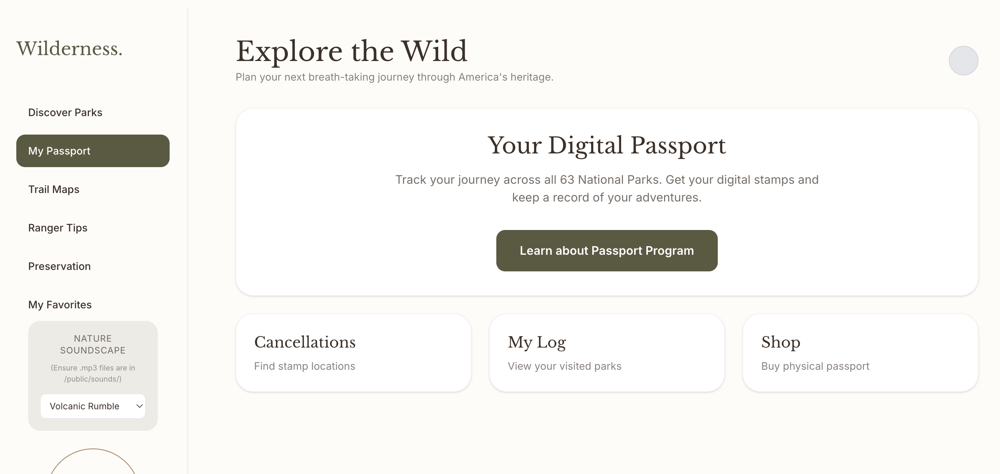
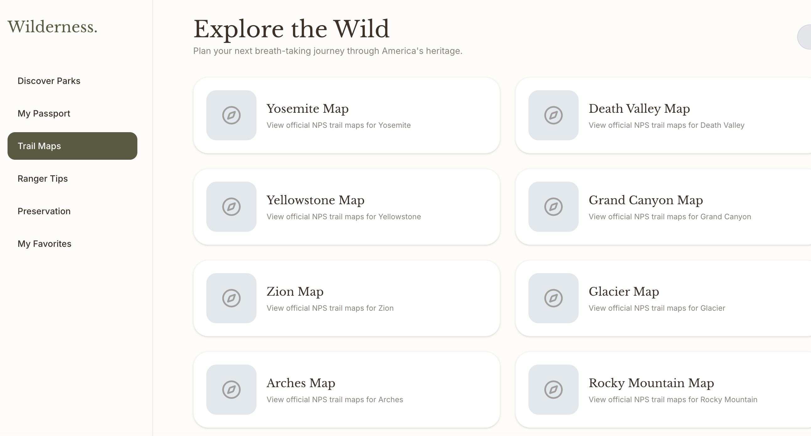
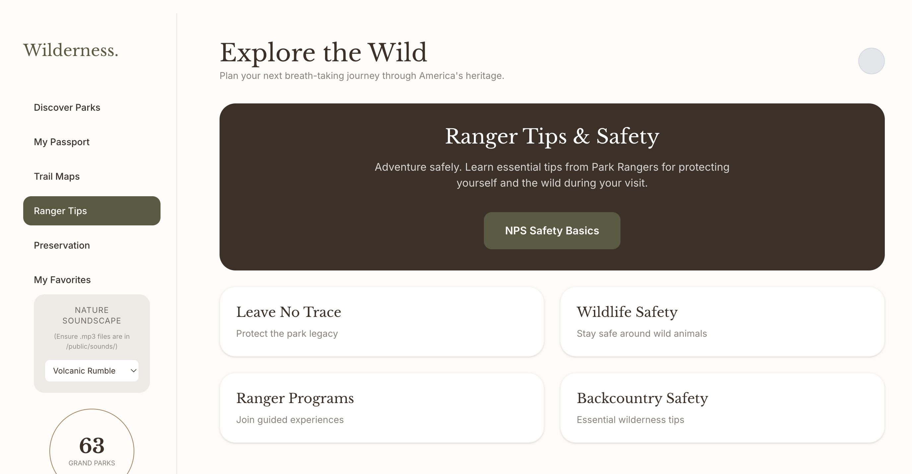
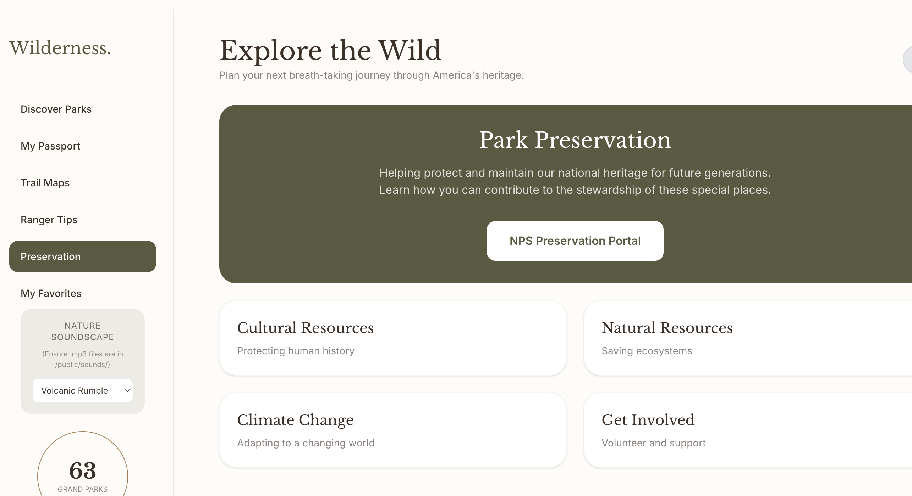

  

<h1 align="center">Wilderness: National Park Explorer</h1>

  A refined digital companion for discovering, planning, and wandering through the U.S. National Parks.

  Park discovery · Trail maps · Ranger tips · Preservation · Passport · Soundscape

## Overview

**Wilderness** is a thoughtfully designed web experience for exploring the United States National Parks through a calm, editorial, and immersive interface. Rather than functioning like a dense booking tool or data-heavy directory, it presents the park system as something more atmospheric: a national archive of landscapes, trails, stories, preservation work, and personal memory.

The app helps users browse parks, view trail-map resources, explore ranger safety guidance, learn about preservation, and interact with a digital passport-style companion. A built-in **nature soundscape player** adds another layer of mood, turning trip planning into something slower, warmer, and more inhabitable.

It is part travel guide, part digital field companion, and part quiet invitation to look at America’s wild places with more care.

## Features

- **Park Discovery**  
  Browse featured national parks through large visual cards, location details, and curated overview sections.

- **Digital Passport**  
  Explore a passport-inspired section designed as a companion to park visits, stamps, logs, and memory-keeping.

- **Trail Maps**  
  Access official NPS trail-map resources for major parks in a clean, lightweight browsing flow.

- **Ranger Tips & Safety**  
  View essential wilderness guidance, including Leave No Trace, wildlife safety, ranger programs, and backcountry awareness.

- **Preservation**  
  Learn about stewardship, climate responsibility, cultural resources, natural resources, and ways to support park preservation.

- **Immersive Nature Soundscape**  
  Switch between ambient environmental soundscapes while browsing, adding a contemplative layer to the experience.

- **Favorites Flow**  
  Designed to support a more personal relationship with parks through saving and revisiting meaningful places.

## Screenshots

### Discover Parks

### My Passport

### Trail Maps

### Ranger Tips & Safety

### Preservation

## Design Direction

The visual language of **Wilderness** is intentionally soft, spacious, and grounded.  
It draws on:

- muted earth tones
- serif-led editorial typography
- rounded archival cards
- quiet museum-like navigation
- landscape-first composition
- subtle ambient interaction through sound

The goal was to make the app feel less like a utility dashboard and more like a **modern field journal for national parks**.

## Why I Built It

Many park-related websites are informative, but they often feel fragmented, overly functional, or visually noisy. I wanted to build something that preserved the usefulness of park information while making the experience feel more unified, elegant, and emotionally resonant.

**Wilderness** imagines what a National Park explorer might feel like if it were designed with the calm of a printed travel archive and the softness of a digital nature room.

## Tech Stack

- React / Next.js
- TypeScript
- Tailwind CSS
- Vercel

## Data & References

Information and map references are curated from the official [National Park Service (NPS)](https://www.nps.gov/).

## Credits

- **Author**: Yuyao Wang
- **Contact**: [yuyaow@bu.edu](mailto:yuyaow@bu.edu)

## License

© 2026 Yuyao Wang. All rights reserved.
